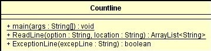

## INTRODUCTION TO JAVA, MVN, AND GIT: LOC Counting
### Miguel Ángel Rodríguez Siachoque
### 2 de Junio de 2021

## Ejecución de Countline.java

Debe ser ejecutado con dos parametros: 
<ul>
  <li>La opción debe ser "loc" o "phy".
  <li>La dirección del archivo tipo: TestText\Example1.txt
</ul>

## Diagrama de Clases

<ul>
  <li>main( String[] args )
    

       Es el metodo principal de main con el cual se recolecta la informacion:
       <ul>
         <li>args[0] = Opción "loc" o "phy".
	 <li>args[1] = Dirección del archivo a contar lineas.
       </ul>
       La salida sera la cantidad de lineas según la opción.
    <!p>
  <li>ReadLine (String option, String locationFile)
    > 

       Es el metodo encargado de leer el archivo y almacenar las lineas de este.
       <ul>
         <li>option = La opcion obtenida en main.
	 <li>locationFile = La locacion obtenida en main.
       </ul>
       Retornara una lista donde estaran todas las lineas del archivo.
    <!p>
  <li>ExceptionLine (String excepLine)
    

       Es el metodo encargado de verificar las lineas que no estan vacias o comentadas.
       <ul>
         <li>excepLine = La linea que se quiere verificar.
       </ul>
       Retornara un booleano donde si es True, la linea cumple con los requisitos, de lo contrario no se agregara.
    <!p>
</ul>
<!p>

## JavaDoc:
<ul>
  <li>[JavaDoc - LOC Counting]<JavaDocs/index.html>
</ul>

## Tiempo de Lineas LOC: 

 
El archvivo Countline.java contiene un total de 84 lineas, 
realizados en un tiempo de aproximadamente 6,5 horas: 
46/6,5 = 7 lineasLOC/horas.  
El archvivo CountlineTest.java contiene un total de 77 lineas, 
realizados en un tiempo de aproximadamente 1 hora: 
62/1 = 62 lineasLOC/horas.

### Tiempo total:

104/7,5 = 13.86 lineasLOC/horas.

